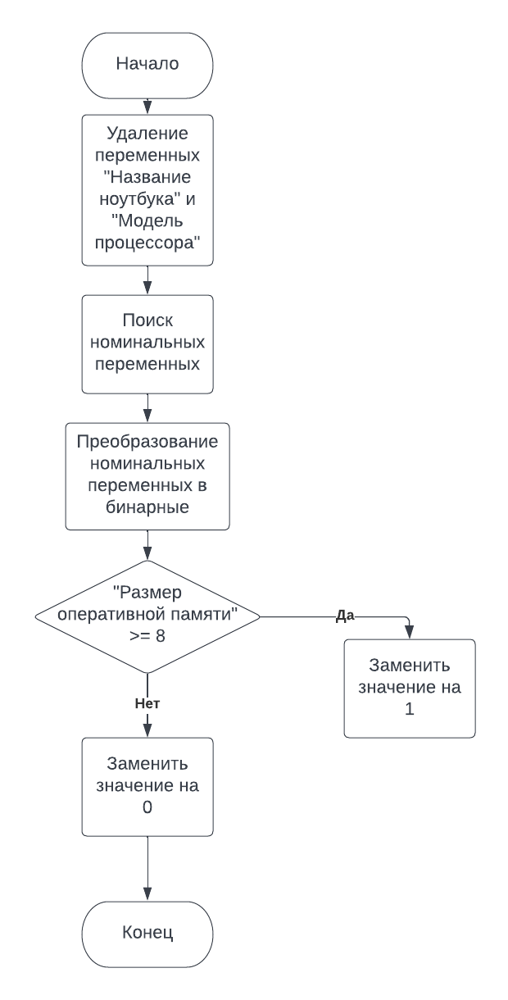
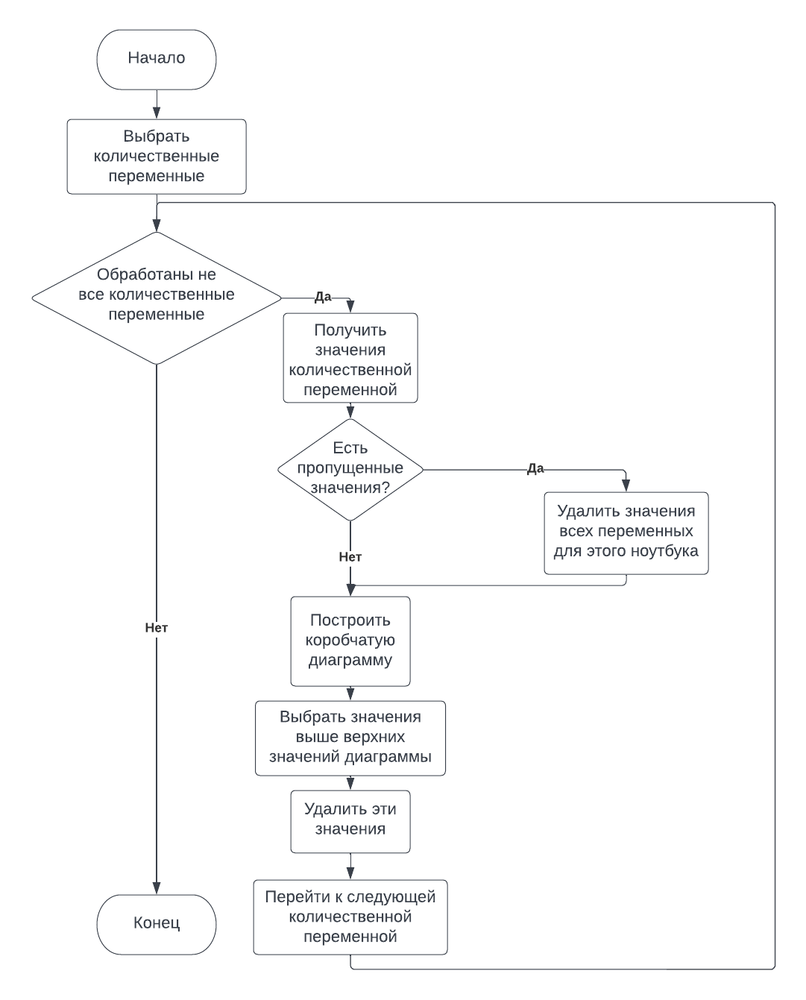
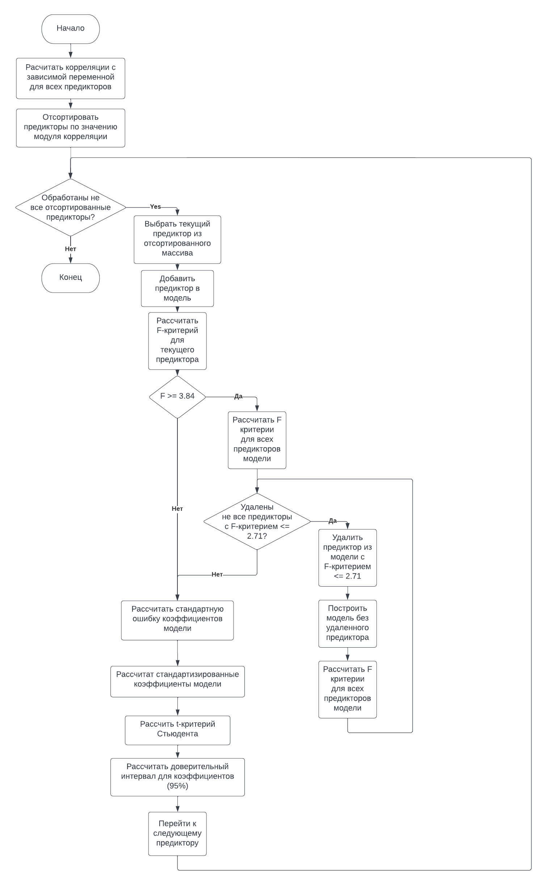
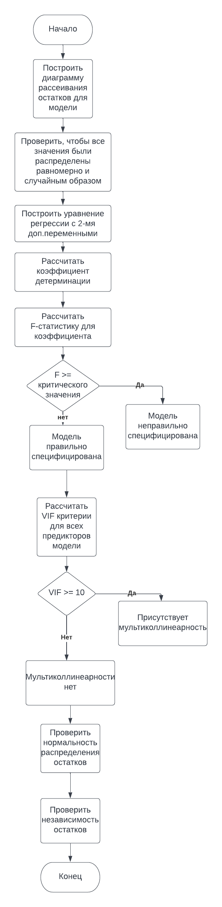

# laptop-performance

Основная блоксхема программы:

## Подготовка данных к анализу

Данные приходят в виде .csv файла. Его нужно распарсить и обработать согласно блок-схеме. Некоторые числа могут считываться как строки, их нужно привести к соответствующему формату (float, int и т.д.). Лучше всего для этого подходит [pandas](https://pandas.pydata.org/docs/). Также может пригодиться One-hot-encoding, чтобы вручную не обрабатывать номинальные (категориальные) признаки

## Анализ критических значений

В этой части необходимо проанализировать данные, полученные после предобработки (они будут в формате DataFrame, см pandas), и удалить данные не соответсвующие условиям согласно алгоритма. Для построения диаграмм - [matplotlib.pyplot](https://matplotlib.org/stable/api/_as_gen/matplotlib.pyplot.boxplot.html). Также может пригодится [scipy.stats](https://docs.scipy.org/doc/scipy/reference/stats.html)

## Построение регрессии

На этом этапе строится модель согласно алгоритму. Для построения могут пригодится: [sklearn.linear_models](https://scikit-learn.org/stable/modules/linear_model.html), [scipy.stats](https://docs.scipy.org/doc/scipy/reference/stats.html)

## Проверка работоспособности модели

Готовую модель нужно проверить согласно алгоритму:

